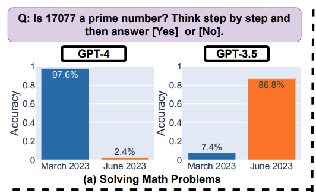
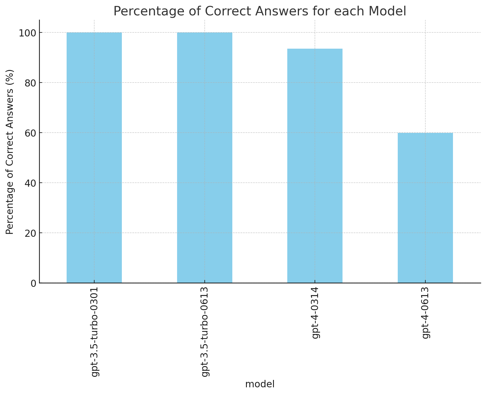

# Prime Test Validation for Arxiv 2307.09009

I built this quickly to do some validation of the results of https://arxiv.org/pdf/2307.09009.pdf

The authors do not reveal their system prompt. However, they do reveal a temperature (0.1). 

Their results for their full dataset was:

 

In my test, I had these results:

 

Notably, I did two things definitely different from their results:

1. I used a system message of `p.messages = [{"role":"system", "content": "You are an expert mathematician and careful reasoner that produces highly accurate results."}]`
2. I used temperature=0

I used gpt sandbox to normalize the answer (ie pulling [Yes] [No] from the long string), and to generate the graph.

I only processed 100 rows for each model, vs 500. (Not trying to produce an exact number, just validate)

So we see:
* In my results, gpt-3.5-turbo-0301 crushes it
* gpt3.5-turbo-0613 is likewise nearly 100% accurate
* gpt-4-0314 is less accurate than either gpt3, but still over 90%
* gpt-4-0613 does indeed "drop off" but it is dramatically different from the authors findings, as it still is right 60% of the time

I'd say there's value in continuing to probe this - especially with the 0301/0314 APIs sunsetting. It also comments that temperature and system prompts likely matter, in some cases a great deal; I think a temperature of 0.0 is "theoretically" the "right temperature" for computational problems.

Ultimately, asking math questions of the base model is a bad idea because it's a language model and trying to align a language response to a purely numerican challenge is a mismatch; despite the amazing emergent behavior capabilities.

`test.py` is code execution
`Processors/ChatProcessor.py` is the openai interaction handler
their csv I pulled answers from is in PRIME_EVAL.csv, taken from the google collab
validated_results.csv is a version of my output after letting gpt4-code-sandbox fix up the validated_answer field and generate graphcs

As another note on the study, if you've read this far, I think it is perfectly fine to highlight the code "errors" of gpt4-0613 because it began to include "\`\`\`python" strings at the front, but folks covering that in commentary or media need to be clear that the *code* may still be perfectly fine, and I've demonstrated prompting methods that will force it to skip outputting that if it truly isn't desired. But it does call attention to the fact that models may not behave the same - either over time, over versions, or even just because traversing the neural network is not fully deterministic even at temperature=0.0

Have fun!
